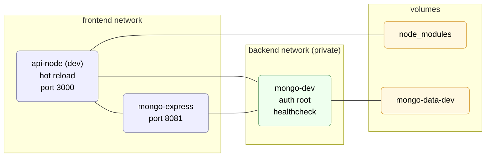
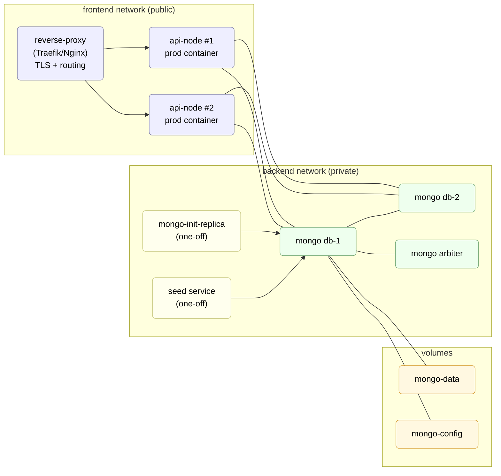

# Promotion Workflow Demo

A minimal demo to streamline the promotion request process:

- Employee submits a promotion application,
- Line manager reviews, returns with a comment, or approves.

Tech (so far): Node.js with Express (TypeScript) for the backend, MongoDB, Docker (development mode). Swagger for API documentation.
Frontend and the rest will be added next.

---

## Quick start

### Requirements

- Node.js 22.18.0 (LTS)
- Docker Desktop

### 1 Run backend using Docker in dev mode

```bash
cd infra/docker
make compose-up-build
```

### 2 Ports

- **Backend service (Node.js + Express):** http://localhost:3000
- **MongoDB database:** mongodb://localhost:27017
- **Mongo Express (database viewer):** http://localhost:8081

### 3 Create a sample application (CURL)

```bash
curl -X POST http://localhost:3000/applications \
  -H "Content-Type: application/json" \
  -d '{
    "employeeId":"emp_1",
    "managerId":"mgr_1",
    "fields": {
      "currentLevel":"L1",
      "targetLevel":"L2",
      "certCount": 2,
      "projectRevCount": 1,
      "perfomanceRevCount": 1,
      "justification":"I delivered impact X and Y"
    }
  }'
```

### 4 API Endpoints and schemas documentation

http://localhost:3000/docs/

### 5 Development Architecture



### 6 Production Architecture


