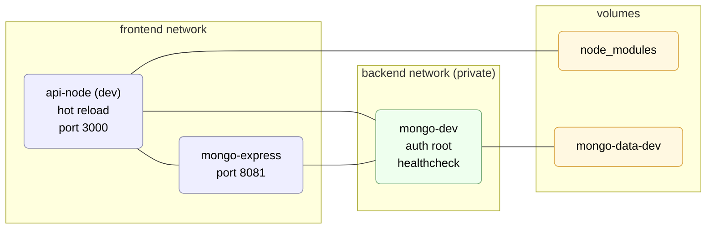

```mermaid
flowchart LR
  classDef svc fill:#eef,stroke:#88a,color:#000,stroke-width:1px,rx:6,ry:6
  classDef one fill:#efe,stroke:#7a7,color:#000,stroke-width:1px,rx:6,ry:6
  classDef net fill:#f7f7f7,stroke:#bbb,color:#000,stroke-dasharray:3 3,rx:8,ry:8
  classDef vol fill:#fff8e1,stroke:#d9a441,color:#000,rx:6,ry:6

  subgraph FRONTEND["frontend network"]
    class FRONTEND net
    API["api-node (dev)<br/>hot reload<br/>port 3000"]:::svc
    ME["mongo-express<br/>port 8081"]:::svc
  end

  subgraph BACKEND["backend network (private)"]
    class BACKEND net
    DB["mongo-dev<br/>auth root<br/>healthcheck"]:::one
  end

  API --- ME
  API --- DB
  ME  --- DB

  subgraph VOLS["volumes"]
    class VOLS net
    VNM["node_modules"]:::vol
    VMONGO["mongo-data-dev"]:::vol
  end

  API --- VNM
  DB  --- VMONGO
```
