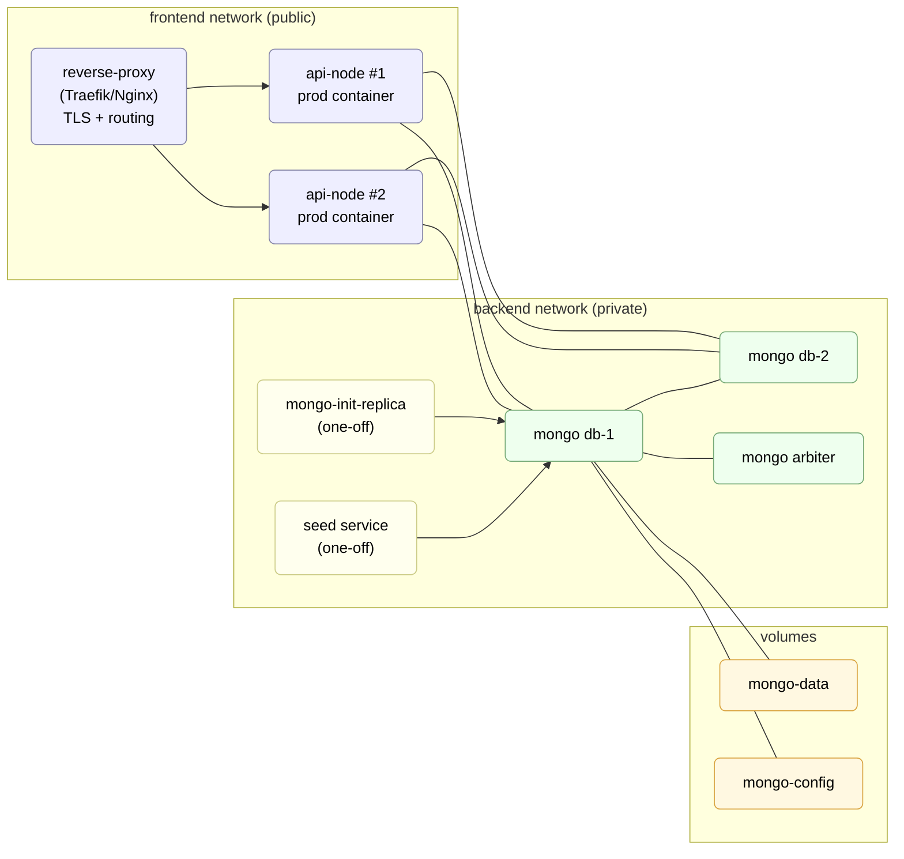

```mermaid
flowchart LR
  classDef svc fill:#eef,stroke:#88a,color:#000,stroke-width:1px,rx:6,ry:6
  classDef db  fill:#efe,stroke:#7a7,color:#000,stroke-width:1px,rx:6,ry:6
  classDef job fill:#ffe,stroke:#cc8,color:#000,stroke-width:1px,rx:6,ry:6
  classDef net fill:#f7f7f7,stroke:#bbb,stroke-dasharray:3 3,rx:8,ry:8
  classDef vol fill:#fff8e1,stroke:#d9a441,color:#000,rx:6,ry:6

  subgraph FRONTEND["frontend network (public)"]
    class FRONTEND net
    RP["reverse-proxy<br/>(Traefik/Nginx)<br/>TLS + routing"]:::svc
    API1["api-node #1<br/>prod container"]:::svc
    API2["api-node #2<br/>prod container"]:::svc
  end

  subgraph BACKEND["backend network (private)"]
    class BACKEND net
    DB1["mongo db-1"]:::db
    DB2["mongo db-2"]:::db
    DBA["mongo arbiter"]:::db
    INIT["mongo-init-replica<br/>(one-off)"]:::job
    SEED["seed service<br/>(one-off)"]:::job
  end

  subgraph VOLS["volumes"]
    class VOLS net
    VMONGO["mongo-data"]:::vol
    VCONF["mongo-config"]:::vol
  end

  %% edges
  RP --> API1
  RP --> API2

  API1 --- DB1
  API2 --- DB1
  API1 --- DB2
  API2 --- DB2

  DB1 --- DB2
  DB1 --- DBA

  INIT --> DB1
  SEED --> DB1

  DB1 --- VMONGO
  DB1 --- VCONF

```
